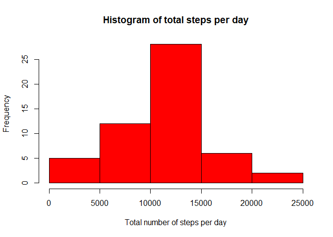
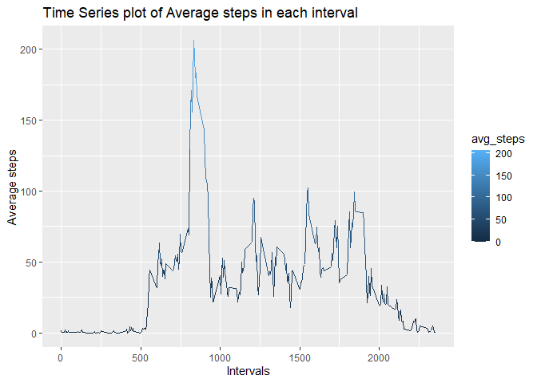
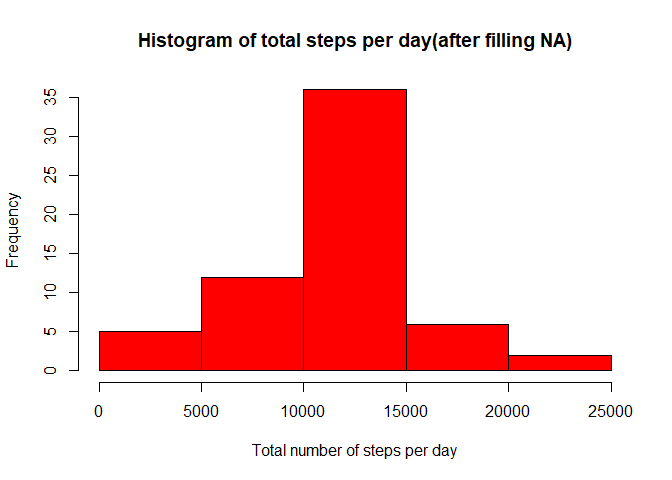
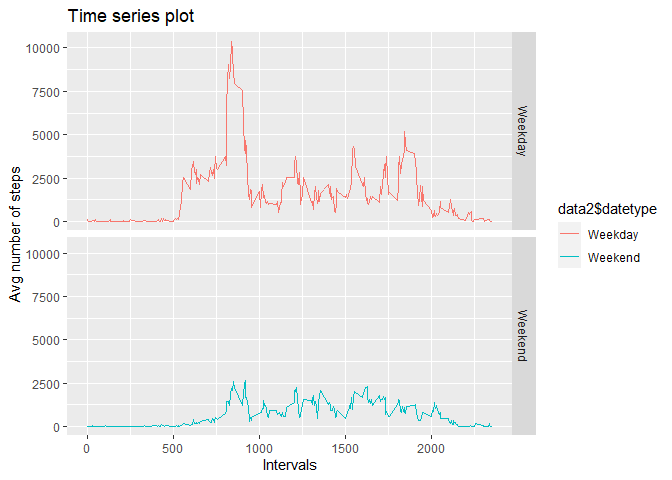

## Activity Dataset
The dataset is obtained for a personal activity monitoring device. This device collects data at 5 minute intervals through out the day. The data consists of two months of data from an anonymous individual collected during the months of October and November, 2012 and include the number of steps taken in 5 minute intervals each day.

## Load the data

Loading the activity data to working directory with read.csv() function.

```r
data<-read.csv("activity.csv")
head(data)
```

```
##   steps       date interval
## 1    NA 2012-10-01        0
## 2    NA 2012-10-01        5
## 3    NA 2012-10-01       10
## 4    NA 2012-10-01       15
## 5    NA 2012-10-01       20
## 6    NA 2012-10-01       25
```
The data has 3 fields namely:

* steps
* date
* interval

## Preprocessing the data

```r
library(dplyr)
```

```
## 
## Attaching package: 'dplyr'
```

```
## The following objects are masked from 'package:stats':
## 
##     filter, lag
```

```
## The following objects are masked from 'package:base':
## 
##     intersect, setdiff, setequal, union
```

```r
datagrp<-group_by(data,data$date)
```
The dataset is grouped by the date field using group_by from dplyr package.

#Mean total number of steps taken per day

## Calculating the total number of steps taken per day


```r
stepsperday<-summarise(datagrp,total_steps=sum(steps))
stepsperday
```

```
## # A tibble: 61 x 2
##    `data$date` total_steps
##    <fct>             <int>
##  1 2012-10-01           NA
##  2 2012-10-02          126
##  3 2012-10-03        11352
##  4 2012-10-04        12116
##  5 2012-10-05        13294
##  6 2012-10-06        15420
##  7 2012-10-07        11015
##  8 2012-10-08           NA
##  9 2012-10-09        12811
## 10 2012-10-10         9900
## # ... with 51 more rows
```

The total steps taken per day is calculated using summarise function on the grouped data.

## Histogram of total steps taken each day
Histogram of total steps taken each day is obtained by using the hist function.

```r
hist(stepsperday$total_steps,xlab="Total number of steps per day", col="red",main="Histogram of total steps per day")
```

<!-- -->

## Calculating Mean and Median 
The mean of total steps per each day is calculated using mean function.

```r
mean<-mean(stepsperday$total_steps,na.rm=TRUE)
mean
```

```
## [1] 10766.19
```
The median of total steps per each day is calculated using median function.

```r
median<-median(stepsperday$total_steps,na.rm=TRUE)
median
```

```
## [1] 10765
```
Hence mean and median are calculated.

# The average daily activity pattern

## Time series plot
The data is grouped by the interval factor and average steps and total steps are calculated using the summarise function.
The ggplot2 package is loaded for using the graphical functions. The average steps is ploted against the interval and the variation in range is shown by colour variation. the result is a time series plot.

```r
datagrp2<-group_by(data,data$interval)
interval_steps<-summarise(datagrp2,avg_steps=mean(steps,na.rm=TRUE),total_steps=sum(steps,na.rm=TRUE))
library("ggplot2")
ggplot(interval_steps,aes(`data$interval`,avg_steps,col=avg_steps),type="l")+geom_line()+xlab("Intervals")+ylab("Average steps")+ggtitle("Time Series plot of Average steps in each interval")
```

<!-- -->

## Interval with maximum number of steps
The interval with maximum number of steps is obtained by subsetting the summarised data on the condition that its total steps is the maximum of all total sets over other intervals.

```r
interval_steps$`data$interval`[interval_steps$total_steps==max(interval_steps$total_steps)]
```

```
## [1] 835
```

# Imputing missing values

## Total number of missing values in the dataset
The total number of missing values in the dataset is calculated by summing up all the incomplete cases.

```r
sum(!complete.cases(data))
```

```
## [1] 2304
```

## Filling in all of the missing values in the dataset
An alternative for the missing values is generated by finding the mean steps for each interval stored in the alt variable.

```r
alt <- interval_steps$avg_steps[match(data$interval, interval_steps$`data$interval`)]
```

## New dataset with missing value filled
The new dataset with missing value filled is obtained by assigning the values from alt if it is missing otherwise it is assigned with the original data.

```r
data2 <- transform(data, steps = ifelse(is.na(data$steps), yes = alt, no = data$steps))
head(data2)
```

```
##       steps       date interval
## 1 1.7169811 2012-10-01        0
## 2 0.3396226 2012-10-01        5
## 3 0.1320755 2012-10-01       10
## 4 0.1509434 2012-10-01       15
## 5 0.0754717 2012-10-01       20
## 6 2.0943396 2012-10-01       25
```

## Histogram total steps taken each day
As before the dataset is grouped by date and summarised to obtain the total steps for each day. It is then plotted to histogram using hist function.

```r
datagrp3<-group_by(data2,data2$date)
stepsperday2<-summarise(datagrp3,total_steps=sum(steps))
hist(stepsperday2$total_steps,xlab="Total number of steps per day", col="red",main="Histogram of total steps per day(after filling NA)")
```

<!-- -->

## Mean and median total number of steps taken per day
The mean of total steps per each day is calculated using mean function.

```r
mean<-mean(stepsperday2$total_steps,na.rm=TRUE)
mean
```

```
## [1] 10766.19
```
The median of total steps per each day is calculated using median function.

```r
median<-median(stepsperday2$total_steps,na.rm=TRUE)
median
```

```
## [1] 10766.19
```

The impact of filling the missing value is the median value has changed whereas the mean remains the same.
This is because I used the mean value to replace the missing values.
Different approach may impact the data in different ways.

# Differences in activity patterns between weekdays and weekends

## Creating new factor variable
The date field is converted to class date using as.Date().
It is the categorized into Weekend if that date is Sunday or Saturday otherwise Weekday. This type is stored in newly created datetype field in the dataset.

```r
data2$date <- as.Date(strptime(data2$date, format="%Y-%m-%d"))
data2$datetype <- sapply(data2$date, function(x) {
        if (weekdays(x) == "Saturday" | weekdays(x) =="Sunday") 
                {y <- "Weekend"} else 
                {y <- "Weekday"}
                y
        })
```

## Time series plot
The new data is grouped by datetype and interval and then summarised to get the total steps. The data is then ploted into a time series plot with two panels indicating the categories - weekends and weekdays.

```r
datagrp4<-group_by(data2,data2$datetype,data2$interval)
datetype_summary<-summarise(datagrp4,steps=sum(steps))
ggplot(datetype_summary,aes(`data2$interval`,steps,col=`data2$datetype`),type="l")+geom_line()+facet_grid(datetype_summary$`data2$datetype`~.)+xlab("Intervals")+ylab("Avg number of steps")+ggtitle("Time series plot")
```

<!-- -->

The analysis on the activity dataset is done succesfully.
